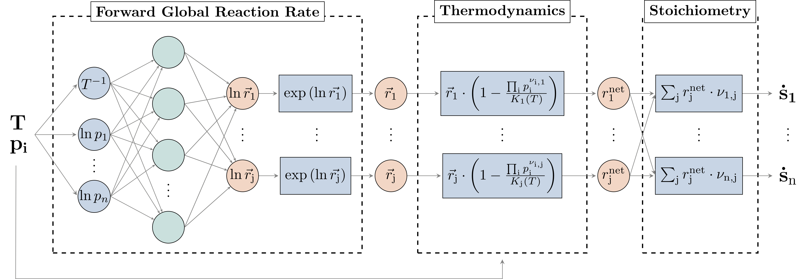

# Global Reaction Neural Networks: A Python Package for efficiently modelling chemical kinetics

[](http://creativecommons.org/licenses/by/4.0/)

This repository provides an implementation of the **Global Reaction Neural Network (GRNN)**, as presented in:

**Kircher, T., Döppel, F. A., & Votsmeier, M.**  
*"Global Reaction Neural Networks with Embedded Stoichiometry and Thermodynamics for Learning Kinetics from Reactor Data."*  
_Chemical Engineering Journal 485 (2024) 149863_  
[DOI: 10.1016/j.cej.2024.149863](https://doi.org/10.1016/j.cej.2024.149863)

## 📖 Overview

This package provides a **Pytorch implementation** of GRNN for learning and modeling chemical kinetics efficiently. It embeds **stoichiometric and thermodynamic constraints** to improve accuracy, robustness, and data efficiency compared to conventional neural networks.



The implementation allows:
- Learning **surrogate models** for chemical kinetics with **embedded physical constraints**
- Using GRNNs for **reactor-scale simulations** and **kinetic model acceleration**
- Integration with **neural ODEs** using **torchdiffeq** 

After installing the dependencies, you can run the main script for model training by

```bash
python main.py
````

## 🔧 Dependencies & Configuration

This implementation relies on **NASA7 polynomials** for thermodynamic calculations and predefined **global reactions**.

### 📂 Required Data Files:
- **NASA7 Polynomials:** Located in [`data/TD_coeffs`](data/TD_coeffs.csv).  
  - These coefficients **must be adapted** to match the chemical system at hand.
- **Global Reactions:** Stored in [`data/MStoic`](data/MStoic.csv).  
  - The implementation currently uses:
    -  **Water-gas shift reaction**
    -  **CO oxidation**
    -  **H₂ oxidation**
  - **You must modify these** to fit your specific chemical system.
- **Training data:** Stored in [`data/training_conditions`](data/training_conditions.csv) and [`data/training_sdot`](data/training_sdot.csv).
    -  System state (conditions) and steady state chemical sourceterms (sdot)
    -  The implementation currently uses data for the preferential oxidation of CO on Pt ([DOI: 10.1016/j.apcata.2011.02.031](https://doi.org/10.1016/j.apcata.2011.02.031))
    -  For details on training data generation see Section 3.1.1.1 [DOI: 10.1016/j.cej.2024.149863](https://doi.org/10.1016/j.cej.2024.149863)

### 🛠 Code Structure:
- **Model training** The model is trained in [`main.py`](main.py)
- **Data Loading:** Managed by the [`ChemicalReactions`](GlobalReactionNeuralNetwork/chem_struct.py) and
[`Dataset`](GlobalReactionNeuralNetwork/load_data.py) classes
- **Global Reaction Neural Network:** [`model.py`](GlobalReactionNeuralNetwork/model.py) contains the GRNN for representing chemical kinetics
- **Visualization**  [`visualize.ipynb`](visualize.ipynb) contains visualization of results for trained GRNNs.
   
## 📦 Installation

```bash
git clone https://github.com/VotsmeierGroup/GlobalReactionNeuralNetwork
cd GlobalReactionNeuralNetwork
conda env create -f environment.yml
```
## How to Cite

If you use **Global Reaction Neural Networks** in your research, please cite the following article:

```bibtex
@article{Kircher2024Global,
  title   = {Global Reaction Neural Networks with Embedded Stoichiometry and Thermodynamics for Learning Kinetics from Reactor Data},
  author  = {Kircher, T. and Döppel, F. A. and Votsmeier, M.},
  journal = {Chemical Engineering Journal},
  volume  = {485},
  pages   = {149863},
  year    = {2024},
  doi     = {10.1016/j.cej.2024.149863}
}

